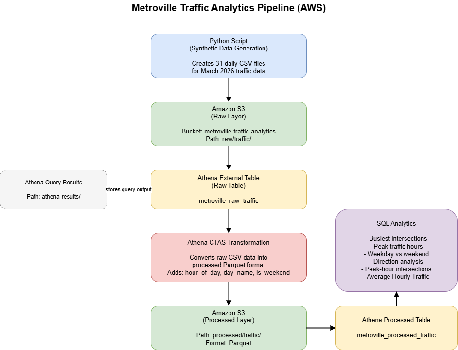
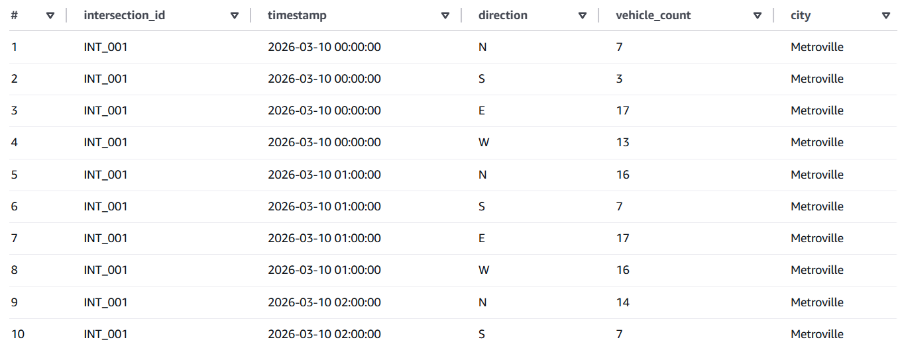
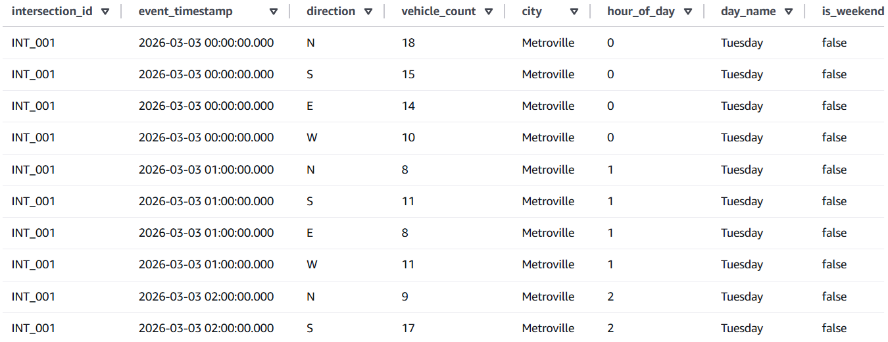
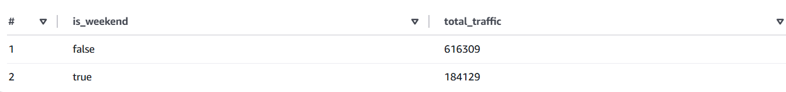

# 🚦 Metroville Traffic Analytics Pipeline (AWS)

## 📌 Project Overview
This project simulates and analyzes traffic patterns in a fictional city (Metroville) using a cloud-based data pipeline on AWS.

The pipeline ingests synthetic traffic data, stores it in Amazon S3, transforms it using Athena, and generates insights about traffic volume, peak hours, and congestion patterns.

This type of analysis can help city planners identify congestion hotspots, optimize traffic signal timing, and improve overall traffic flow efficiency.

---

## 🔑 Key Skills Demonstrated

- Built an end-to-end batch data pipeline using Amazon S3 and Athena  
- Designed a layered data architecture (raw → processed → analytics)  
- Used Athena CTAS (CREATE TABLE AS SELECT) to transform CSV data into optimized Parquet format  
- Applied SQL for data transformation, aggregation, and business analysis  
- Generated synthetic datasets to simulate real-world traffic patterns  
- Structured a reproducible and scalable analytics workflow in a cloud environment  

---

## 🏗️ Architecture

The transformation step uses Athena CTAS (CREATE TABLE AS SELECT) to convert raw CSV data into columnar Parquet format, improving query performance and reducing data scan costs.

Data is processed through a batch pipeline:

Raw CSV Data → S3 → Athena → Transformation → Processed Data → Analytics

---

## 📊 Dataset

The dataset represents hourly traffic counts across 10 intersections in Metroville.

Each record includes:
- intersection_id  
- timestamp  
- direction (N, S, E, W)  
- vehicle_count  
- city  

### Data characteristics:
- 31 days of data (March 2026)  
- Hourly granularity  
- ~29,760 total records  
- Lower traffic on weekends  
- Simulated morning and evening peak hours  

---

## ⚙️ Pipeline Steps

1. Generated synthetic traffic data using Python  
2. Uploaded data to Amazon S3 (manually and via boto3 script)  
3. Created an external table in Athena for raw data  
4. Transformed data using Athena CTAS into a processed table (Parquet format)  
5. Derived additional fields:
   - hour_of_day  
   - day_name  
   - is_weekend  
6. Ran SQL queries to analyze traffic patterns  

---

## 📈 Analytics & Insights

### 1. Busiest Intersections
Traffic volume is concentrated in a small number of intersections, with INT_005, INT_009, and INT_003 handling the highest traffic. INT_005 processed the highest peak-hour traffic volume at 44,207 vehicles.

### 2. Peak Traffic Hours
Peak traffic occurs between 16:00–19:00 (4 PM – 7 PM), with total hourly traffic exceeding 59,000 vehicles. This suggests after-work commuting is the primary driver of congestion.

### 3. Weekday vs Weekend Patterns
Weekday traffic is over 3x higher than weekend traffic (616,309 vs 184,129 vehicles).

### 4. Directional Traffic Distribution
Traffic flow is relatively balanced, with eastbound traffic highest at 211,616 vehicles and southbound lowest at 188,704.

### 5. Peak-Hour Congestion Points
INT_005, INT_009, and INT_003 consistently handle the highest peak-hour loads, indicating likely congestion hotspots.

### 6. Average Traffic Patterns
Average hourly traffic peaks at ~47–48 vehicles during evening hours and ~40 vehicles during morning rush hours.

---

## 📊 Power BI Dashboard

A Power BI dashboard was created to visualize traffic patterns and complement the SQL-based analysis.

### Dashboard Highlights
- Total traffic volume (KPI)  
- Traffic by hour of day  
- Traffic distribution by direction  
- Traffic volume by hour and direction  
- Weekday vs weekend traffic comparison  

### Dashboard Preview

### Notes
This dashboard demonstrates the ability to:
- translate data into visual insights  
- identify traffic patterns across time and direction  
- communicate findings clearly  

---

## 🧪 Sample Queries & Results

### Raw Data Preview

### Processed Data Preview

### Weekday vs Weekend Analysis

---

## 🔁 Reproducibility

The repository includes:
- Python scripts for data generation and S3 upload  
- Athena SQL files for table creation and analysis  
- A documented raw-to-processed data workflow  

---

## ✅ Data Quality Checks

Basic validation checks included:
- detection of null or negative values  
- validation of row counts  
- verification of expected categorical values  

---

## 🛠️ Tech Stack

- AWS S3  
- AWS Athena  
- Python  
- SQL  
- Power BI  

---

## ⚠️ Limitations

- Data is synthetic and may not reflect real-world variability  
- No external factors (weather, accidents, road closures) included  
- Traffic patterns follow simplified assumptions  

---